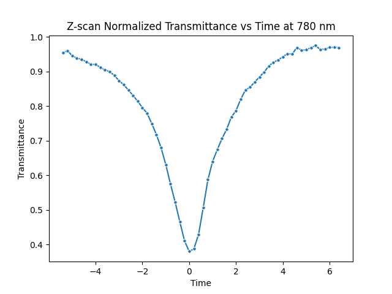
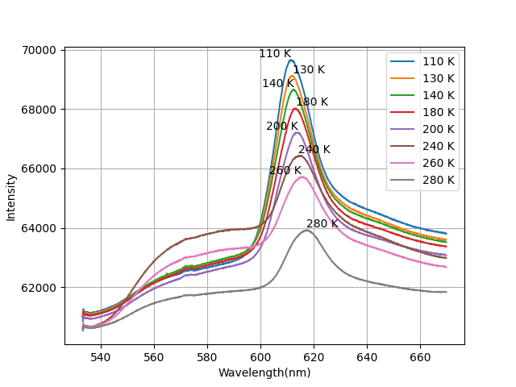

# SRFP internship: data analysis scripts

Python analysis code and data from my 2023 Summer Research Fellowship (Indian Academy of Sciences) at the Department of Physics, IISER Kolkata, supervised by Prof. Bipul Pal (May to July 2023).

**Full report:** [SRFP report (DocSend)](https://docsend.com/view/xfuhms45qq3xvuk5)

## What this repo contains

The internship had two experimental strands. This repo holds the code I wrote to process and analyse the measured data for both.

1. **Non-linear absorption in molecular foldamers.** Open-aperture Z-scan measurements with femtosecond pulses, used to extract the non-linear (two-photon) absorption coefficient.
2. **Temperature-dependent photoluminescence of WS₂ monolayers (6 K to 300 K).** Analysis of how the emission redistributes between energy states and how the band gap contracts with temperature.

Across both, the code does baseline correction, fitting and statistical analysis of the spectra.

## Repository layout

| Path | Contents |
| ---- | -------- |
| `analysis/` | The research scripts (table below) |
| `Data/`, `Data_2/` | Raw and processed measurement files |
| `Normal_Data/` | Normal Distribution generation data |
| `Figures/` | output plots some of which are used in this README |
| `practice/` | Early Python exercises from learning the language, not part of the analysis |

### Analysis scripts

| Script | What it does | Reads | Produces |
| ------ | ------------ | ----- | -------- |
| `Z-scan_experiment.py` | Fits the Z-scan transmittance curve to obtain the non-linear absorption coefficient | `TPA_f1foldamar_Final.csv`, `1000mW_sample_TPA.csv`, `1400mW_sample_TPA.csv` | fit and plot |
| `PL_Experiment.py` | Plots Intensity vs Wavelength for the photoluminescence sample at multiple power levels | `data/...` | plots |
| `PL_Experiment2.py` | Same analysis for the second data set but constant power | `Data_2/...` | plots |
| `PL_Experiment_cont.py`, `PL_Experiment2_cont.py` | Plots the peak intensity vs temp and also the same but averaged over power in case of experiment 1 | `Data/...`,`Data_2/...` | plots |
| `PL_Experiment_csv_gen.py`, `PL_Experiment2_csv_gen.py` | Converts raw instrument output to CSV | `Data/...`,`Data_2/...` | `Data/...`,`Data_2/...` |
| `normal.py`| Generates normal distribution with same mean and standard deviation as the photoluminescence data of experiment 2 | `Data_2/...` | `Normal Data/` |

## Example output


*Open-aperture Z-scan data and fit, produced by `analysis/Z-scan_experiment.py` from `Z_scan_Data/TPA_f1foldamar_Final.csv`.* --

*PL spectra at selected temperatures between 6 K and 300 K, produced by `analysis/PL_Experiment.py`.*

## How to run

Requires Python 3 with `numpy`, `scipy`, `pandas`, `matplotlib`, `Seaborn`, `statistics` and `os`.

```bash
git clone https://github.com/GriimHog/SRFP-python-scripts.git
cd SRFP-python-scripts
pip install numpy scipy pandas matplotlib
python analysis/Z-scan_experiment.py
```

Each script reads its input from the folder named in the table above. The paths need editing before running.

## Notes and limitations

- The data are from the experiments carried out in Prof. Pal's lab at IISER Kolkata during the fellowship and is available on request.
- The scripts were written as working analysis tools for the internship and are not packaged as a library.

## Contact

Priyanshu Sharma. priyanshuaryan2002@gmail.com
